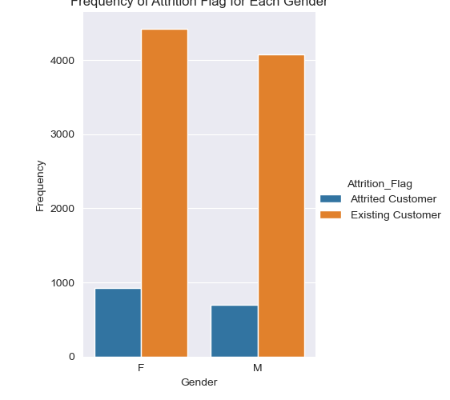
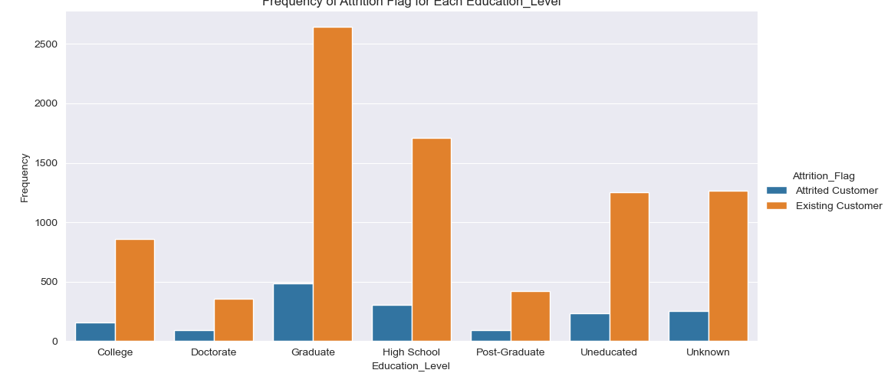
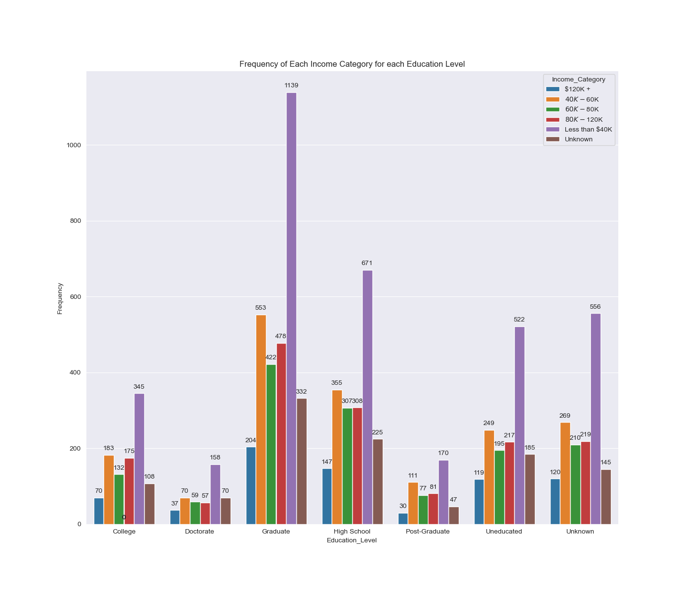
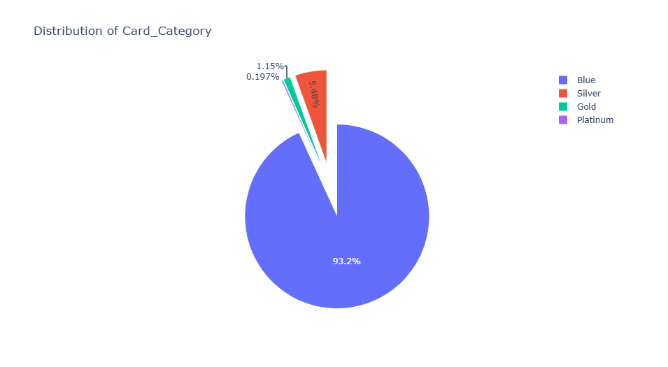
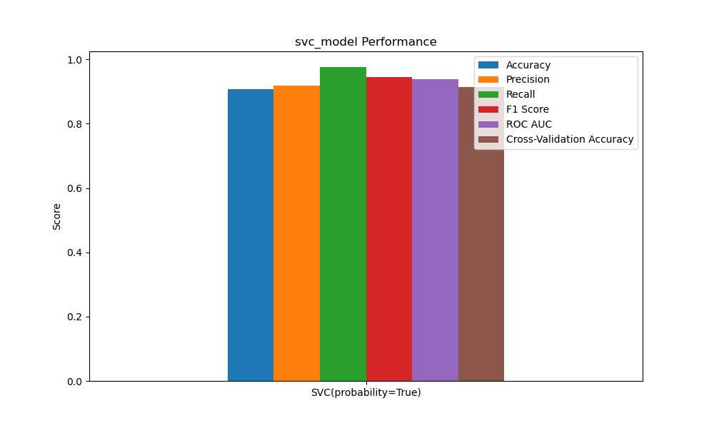

# Capstone Three: Credit Card Customer Prediction 

## 📌 Introduction

A manager at the bank is increasingly concerned with the rising number of customers leaving their credit card services, resulting in a loss of business and revenue. To address this challenge, the bank wants to **predict which customers are at high risk of churning**, enabling proactive interventions to retain them.

The goal is to develop a **predictive model** that can accurately identify customers likely to cancel their credit card services. By doing so, the bank can reach out with personalized offers, better services, or targeted communications to persuade them to stay.

---

## 📚 Libraries Used

```python
import pandas as pd
import numpy as np

# Visualization
import matplotlib.pyplot as plt
import seaborn as sns

# Warnings
import warnings
warnings.filterwarnings("ignore")

# Modeling
from sklearn.preprocessing import StandardScaler, LabelEncoder
from sklearn.model_selection import train_test_split, cross_val_score
from sklearn.metrics import (
    accuracy_score, precision_score, recall_score,
    f1_score, roc_auc_score, classification_report
)
from sklearn.naive_bayes import GaussianNB
from sklearn.ensemble import RandomForestClassifier
from sklearn.linear_model import LogisticRegression
from sklearn.svm import SVC
```

## 📥 Data

```df = pd.read_csv(r'C:\Users\dshaw\Springboard\Capstone Three Credit Card Customer Prediction/Data/BankChurners.csv')```

## 🧠 Understanding the Data
Dataset contains 10127 rows and 23 columns

First and last two columns were dropped to focus on relevant features
```df = df.iloc[:,1:21]```
No missing values and no duplicate records found.

## 📂 Dataset Overview
Target variable: Attrition_Flag (1 = Existing Customer, 0 = Attrited Customer)

Features: Customer demographics, account activity, credit info

Example features:

Customer_Age

Education_Level

Marital_Status

Credit_Limit

Total_Trans_Amt

Avg_Utilization_Ratio
... and more.


## 📊 Exploratory Data Analysis (EDA)

### 🔁 Customer Churn Distribution
Existing Customers: 83.93%

Attrited Customers: 16.07%

### 👥 Churn by Gender
More female customers churn, though overall more females are in the dataset.

### 💍 Marital Status vs Dependent Count
Married customers have the highest dependent count frequencies.

### 🎓 Education Level vs Churn
Most churned customers are Graduates, aligning with the fact that most customers are graduates.


### 💰 Income Category Insights
Majority of customers earn less than $40K

These customers are also the largest churn segment.

### 💳 Card Category Distribution
Blue Card is the most common, which correlates with lower income segments.


## 📈 Distribution of Numerical Features
Numerical columns such as Credit_Limit, Total_Revolving_Bal, Avg_Open_To_Buy, Total_Amt_Chng_Q4_Q1, etc., were plotted to understand their distributions.

### 🔍 Outliers Detected
Box plots revealed multiple outliers in financial columns, which may skew model training.

### 🔥 Correlation Heatmap
A heatmap was generated to study correlations among numeric features. This is essential to detect multicollinearity before modeling.

### 📋 Dataset Summary
```df.describe()```
Avg customer age: ~46 years

Credit limits range from $1,438 to $34,516

Avg utilization ratio varies greatly (min: 0.0, max: 0.999)

## The EDA Results shows that:

Most churned customers are graduates earning under $40K

The most popular card is the Blue card

There’s potential for churn reduction strategies targeting middle-income, educated segments

These insights help shape retention strategies and guide model development to predict attrition risk effectively.

## 🧹 Data Preprocessing

1. One-hot encoding for categorical variables:

Education_Level

Marital_Status

Income_Category

Card_Category

Gender

2. Splitting the dataset:

Training: 75%

Testing: 25%

3. Standardization using StandardScaler:

Applied to both training and test features

## 🤖 Modeling and Evaluation

1.Logistic Regression
Metric	Score
Accuracy	0.8929
Precision	0.9145
Recall	0.9617
F1 Score	0.9375
ROC AUC	0.9069
Cross-Validation Acc	0.9088

2. Support Vector Classifier (SVC)
Metric	Score
Accuracy	0.9076
Precision	0.9181
Recall	0.9763
F1 Score	0.9463
ROC AUC	0.9391
Cross-Validation Acc	0.9135

3. Gaussian Naive Bayes
Metric	Score
Accuracy	0.8598
Precision	0.9088
Recall	0.9248
F1 Score	0.9167
ROC AUC	0.8501
Cross-Validation Acc	0.8761

## 🧾 Conclusion
Among the models tested, the Support Vector Machine (SVC) model with an RBF kernel delivered the best overall performance. It had the highest recall and F1 score, making it excellent for identifying likely churners. While Logistic Regression also performed well—especially in ROC AUC and precision—SVC edged it out due to its ability to capture more true positives.

Naive Bayes trailed behind in overall accuracy and AUC, making it the least favorable option.

Best Model: Support Vector Classifier (SVC)

